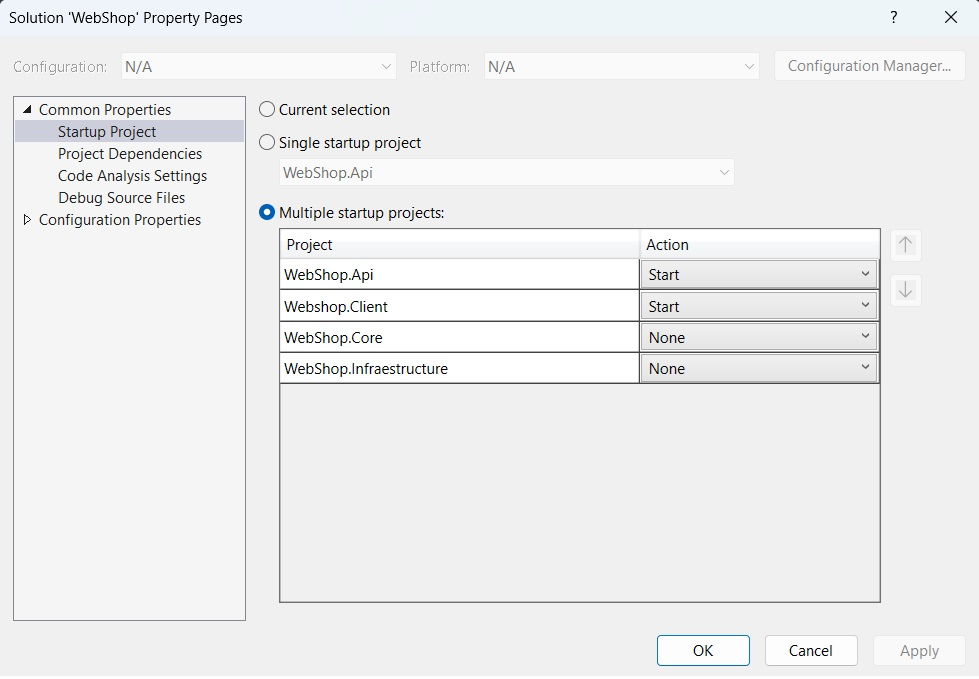

# WebShop Project

This project consists of multiple sub-projects: `WebShop.Api`, `WebShop.Client`, `WebShop.Core`, and `WebShop.Infrastructure`. Follow these steps to get the project running locally.

## Prerequisites

- **Visual Studio 2022**: Make sure you have Visual Studio 2022 installed with the ASP.NET and web development workload.
- **.NET Core 8**: Install .NET Core 8 SDK or later.
- **SQL Server 2016 or Later**: You need to have SQL Server 2016 or a later version installed and running.
- **Node.js and npm**: For running the React client, ensure you have Node.js and npm installed.
- **React and Vite**: The client uses React 18.3.1 and Vite for development and building.

## Getting Started

### Setting Up Multiple Startup Projects

1. **Open the Solution in Visual Studio 2022**:
    - Open the `WebShop.sln` solution file in Visual Studio 2022.

2. **Configure Multiple Startup Projects**:
    - Right-click on the solution in the Solution Explorer and select **Properties**.
    - In the **Common Properties** section, click on **Startup Project**.
    - Select **Multiple startup projects**.
    - Set the `Action` for `WebShop.Api` and `WebShop.Client` to `Start`.
    - Ensure `WebShop.Core` and `WebShop.Infrastructure` are set to `None`.
    - Click **Apply** and then **OK**.

   Your configuration should look like this:

    <!-- Update this path if you add this image to your repository -->

### Updating the Connection String

1. **Locate `appsettings.json` in `WebShop.Api`**:
    - In the `WebShop.Api` project, open the `appsettings.json` file.

2. **Update the Connection String**:
    - Find the `ConnectionStrings` section in `appsettings.json`.
    - Replace the existing connection string with your own. For example:
    ```json
    {
        "ConnectionStrings": {
            "DefaultConnection": "Server=YOUR_SERVER;Database=YOUR_DATABASE;User Id=YOUR_USER;Password=YOUR_PASSWORD;"
        }
    }
    ```
    - Make sure the database is accessible and that your credentials are correct.
    - Save the file.

### Running the Project

1. **Restore Dependencies**:
    - Open a terminal in the root of the solution and run the following command to restore the NuGet packages:
    ```bash
    dotnet restore
    ```
    - Navigate to the `WebShop.Client` directory and install npm packages:
    ```bash
    cd WebShop.Client
    npm install
    ```

2. **Run the Project**:
    - Press `F5` in Visual Studio 2022 to start the project. This will start both the API and the client applications.
    - The `WebShop.Api` will be available at `https://localhost:5001` (or the port specified in the `launchSettings.json`).
    - The `WebShop.Client` will run on a different port, typically `http://localhost:3000`.

### Frontend Setup

- The React client is set up with the following configurations:
    - **React Version**: 18.3.1
    - **Bootstrap**: 5.3.3 for styling
    - **React Router**: 6.26.2 for routing
    - **Vite**: Used for development and build tooling

